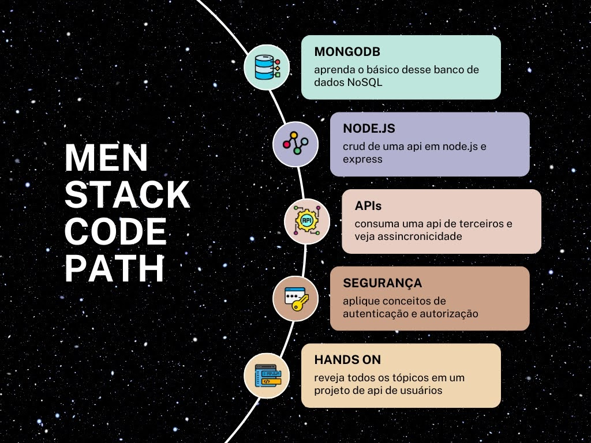

## Introdução

Esse é um repositório que reúne uma trilha de aprendizagem de introdução a `sh node.js`. Aqui você conseguirá achar códigos de uma API Restfull em [Node.js](https://nodejs.org/), utilizando [Express](https://www.npmjs.com/package/express) e conectada ao [MongoDB Compass](https://www.mongodb.com/products/compass)

Algumas outras tecnologias utilizadas: cors, nodemon, bcrypt e axios.

## Tópicos

## Sugestão de Estudo

## Bibliografia
